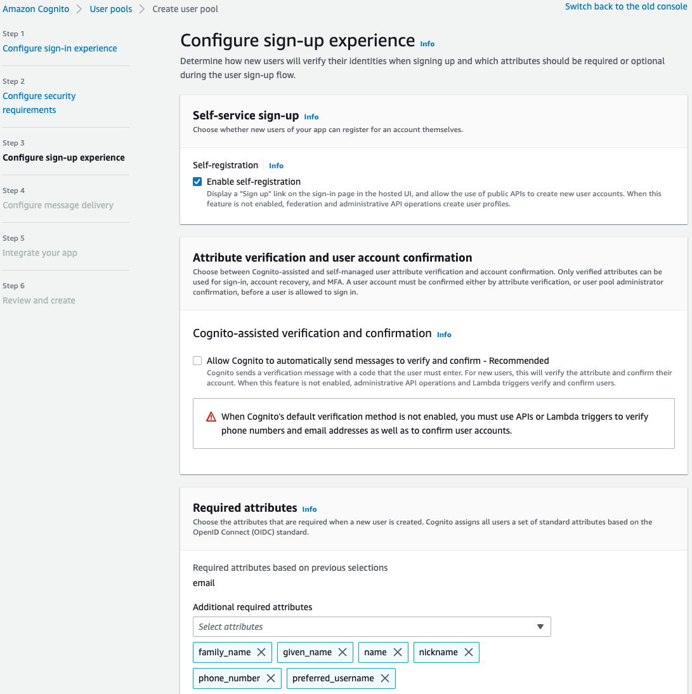

# Amazon Cognito Troubleshooting

## How to troubleshoot when `prefered_username` is not shown in Dev Portal UI?

> Add additional attributes of `prefered_username` when creating a user pool of Amagon Cognito.

- You could find #5 in the following link:

  - [How to set up Amazon Cognito](https://github.com/nginx-openid-connect/nginx-oidc-amazon-cognito/blob/main/docs/01-IdP-Setup.md)

  - Configure **sign-up experience** as the following example when setting up the IdP:

  > Note: select additional required attributes such as `preferred_username` because it is used for **NGINX Dev Portal**.

  
