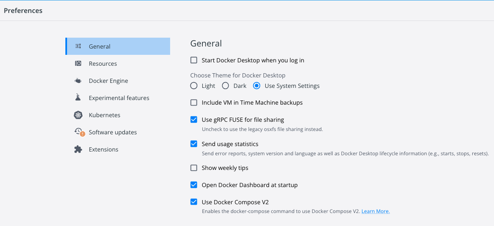
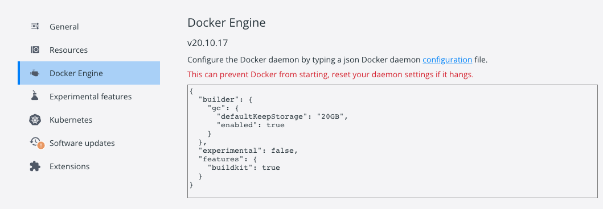
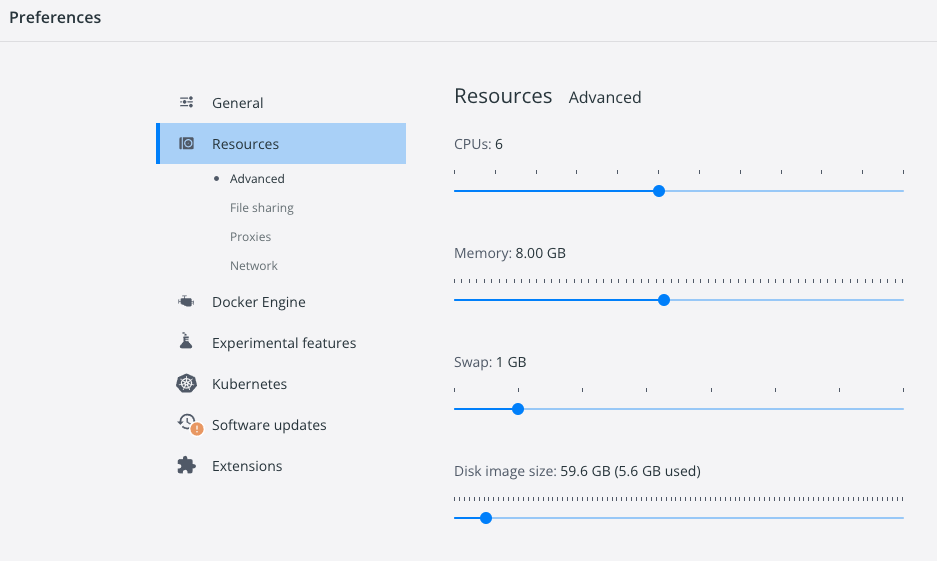

# Keycloak Troubleshooting

## How to troubleshoot when keycloak is not running on Docker container?

> Keycloak is a third party container, and it is the issue of keycloak container image.
> Some steps to troubleshoot the issue are :

> 1.In case your local Docker (e.g., memory) may not be enough for the Keycloak image , make sure your docker configuration matches below :





> 2.In case you see errors in the logs or the server stops after few seconds :
- Try downgrading the version of docker image of keycloak by changing it at [docker-compose.yml](https://github.com/nginx-openid-connect/nginx-oidc-keycloak/blob/main/docker-compose.yml#L28) and rerun `make start`
- Try a different version at ```  image: jboss/keycloak:15.1.0```